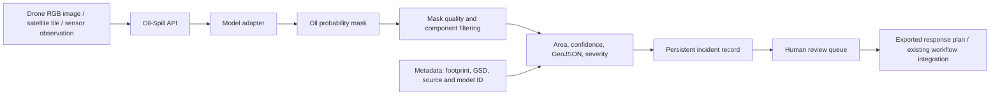

# MineralVision Oil-Spill Intelligence Extension: Architecture

## Purpose

This extension adapts MineralVision’s existing geospatial, AI, drone, workflow, digital-twin, sensor-fusion, reporting, and audit foundations for **maritime oil-spill assessment**. It is designed for decision support after imagery is acquired; it does not initiate external notifications, drone flights, or cleanup actions without an operator-approved workflow.

## Research-Derived Requirements

The implementation is based on a review of the user-supplied paper and repositories. The associated research notes are in [`research-review.md`](research-review.md). The most material requirements are:

| Requirement | Rationale |
|---|---|
| Pixel-level oil mask, rather than a binary image label | Incident extent, area, containment planning, and verification require delineation of the slick. |
| RGB-drone pathway | The cited Scientific Data dataset establishes a practical port-focused RGB segmentation baseline, but it also exposes oil-water boundary ambiguity. |
| Pluggable inference | A deployed model must be explicitly versioned and supplied; no heuristic result may be represented as an operational oil finding. |
| Spatial metrics and GeoJSON | Environmental response requires a location-aware extent, not merely a vision score. |
| Persistent, auditable incident records | Spill assessments must be reviewable, reproducible, and attributable. |
| Human review gate | Computer vision uncertainty, lookalikes, and the high consequence of false alerts preclude unattended operational response. |
| Multi-drone coverage recommendation | The cited search simulator supports coverage prioritization, but live flight actions must remain separate from decision support. |

## System Boundary

## Implementation Components

| Component | Responsibility |
|---|---|
| `api/oil_spill/models.py` | Declares the model-adapter contract and safe TorchScript/ONNX adapters. Model loading is explicit; no unverified model is downloaded or executed. |
| `api/oil_spill/analysis.py` | Validates masks, cleans components, derives confidence and quality flags, estimates area, creates GeoJSON polygons, classifies severity, and produces a coverage-priority grid. |
| `api/oil_spill/schemas.py` | Defines API request/response contracts and metadata validation. |
| `api/endpoints/oil_spill.py` | Provides persistent incident creation, analysis, query, review, and search-planning endpoints. |
| `api/database.py` | Adds `OilSpillIncidentModel` to the platform database. |
| `tests/test_oil_spill.py` | Exercises spatial calculation, quality gating, persistence-oriented serialization, planner behavior, and no-model safeguards. |

## Input and Output Contract

The API supports two controlled analysis modes.

| Mode | Input | Operational use |
|---|---|---|
| `mask` | A user- or model-supplied base64 PNG segmentation mask, where non-zero pixels represent oil | Enables validated downstream area, geometry, severity, storage, and review workflows independent of model runtime. |
| `model` | An uploaded image plus an explicitly configured, local TorchScript or ONNX model adapter | Produces a mask through versioned inference; returns an error when no model is configured. |

A supplied mask is **evidence supplied by the caller**, not an independent detection claim by MineralVision. The request must identify the model/annotation source and version. Geometry conversion requires either a ground-sampling distance (GSD) or a geographic image footprint. When both are unavailable, the API reports pixel area only and marks the result as non-georeferenced.

## Confidence, Quality, and Review

The extension computes an incident confidence from the mean probability within the accepted oil mask, scaled by the retained-area ratio after component filtering. It does not invent confidence from an RGB image without a model. The analysis emits quality flags for small detections, fragmented masks, absent georeferencing, low confidence, and incompatible dimensions.

New incidents begin in `pending_review`. The status can be changed to `confirmed`, `rejected`, or `needs_resurvey` through a separate review endpoint. This deliberately separates analytical inference from environmental-response decisions.

## Integration Roadmap

The initial implementation is a safely deployable assessment service. It has natural integration points with existing MineralVision modules:

1. **WALDO and V-JEPA/Molmo:** imagery preprocessing, embeddings, and temporal change/anomaly context.
2. **Sensor Fusion:** attach GNSS, fluorosensor, pipeline pressure/flow, or water-quality observations as corroborating metadata.
3. **Autonomous Exploration:** provide only an ordered, geospatial priority grid for a drone mission planner; no automatic flight command is emitted.
4. **Digital Twin:** render incident GeoJSON, repeat-survey masks, and time series in an environmental digital twin.
5. **Climate Resilience:** add weather/current observations for drift forecasts in a later calibrated module.
6. **Reporting and Blockchain:** package reviewed incident evidence and immutable provenance references.

## Non-Goals and Safety Constraints

This release does not diagnose oil chemistry, quantify spill volume or mass, predict drift, select cleanup tactics, alert authorities, or control drones/robots. Those functions require calibrated sensors, environmental data, legal operating procedures, and approved human decision-making. The design intentionally avoids automatically executing them.
