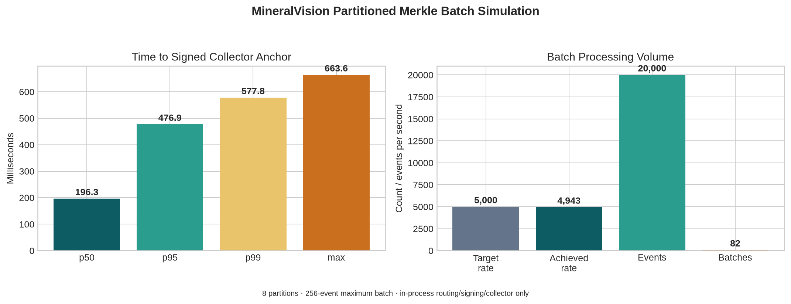

# Partitioned Merkle Batch 5,000 Events/Second Benchmark and Collector Verification

**Prepared by Manus AI**  
**Date:** 22 August 2026

## Result Summary

A controlled in-process simulation targeted 5,000 events per second across eight stable routing partitions. It generated 20,000 synthetic events over 4.046092 seconds, achieved 4,943.042 events per second, sealed 82 signed Merkle batches, had zero collector failures, left zero pending batches, and verified every event inclusion proof and every Ed25519-signed batch commitment.

> The benchmark is not a production throughput claim. It measures routing, canonical commitments, Merkle construction/proofs, in-process Ed25519 batch signing, and a reference collector. It excludes durable queues, PostgreSQL, KMS/HSM latency, mTLS, off-host transport, HA/failover, storage, and production observability overhead.

## Exact Measured Results

| Measure | Value |
|---|---:|
| Target rate | 5,000 events/s |
| Achieved rate | 4,943.042 events/s |
| Synthetic events | 20,000 |
| Elapsed time | 4.046092 s |
| Routing partitions | 8 |
| Maximum batch size | 256 events |
| Sealed batches | 82 |
| Mean batch size | 243.902 events |
| Minimum / maximum batch size | 27 / 256 events |
| Collector failures | 0 |
| Pending batches at completion | 0 |
| Collector anchors | 8 independent tenant/epoch/partition anchors |

| Time from event receipt to signed collector anchor | Milliseconds |
|---|---:|
| Minimum | 6.490 |
| Mean | 215.904 |
| p50 | 196.315 |
| p95 | 476.928 |
| p99 | 577.806 |
| Maximum | 663.620 |



The tail latency reflects the 256-event batch policy and partition distribution rather than a per-event database lock. At 5,000 events/s, a full 256-event batch represents roughly 51.2 ms of nominal arrival time; the larger observed p95/p99 includes end-of-benchmark partial-batch sealing and single-process Python scheduling. A durable deployment must benchmark the intended flush interval and maximum age, not only the batch-size trigger.

## Multi-Partition Off-Host Collector Verification

The reference `MerkleAnchorCollector` accepts only a correctly signed batch whose event commitments all match the batch tenant and whose directed inclusion proofs resolve to the declared root. It stores a separate anchor for every tuple:

```text
(tenant_id, routing_epoch, partition)
```

There is no shared anchor or inferred global temporal order across tenants or partitions. This prevents unrelated streams from blocking each other and prevents a collector from mistakenly treating a valid event in one partition as evidence of ordering in another.

| Collector condition | Result | State change |
|---|---|---|
| Valid next batch | `accepted` | Advances only that chain’s last sequence/root. |
| Exact replay | `duplicate` | No change; idempotently accepted. |
| Child batch before predecessor | `pending` | Stores validated batch keyed by range/root; anchor does not move. |
| Missing predecessor later arrives | `accepted` | Accepts predecessor then drains eligible pending child batches in sequence. |
| Same range, different root | `rejected` | Fork is preserved as evidence; anchor does not move. |
| Wrong batch signature/key | `rejected` | No state change. |
| Event commitment for another tenant | `rejected` | No state change; cross-tenant evidence is never admitted. |
| Bad inclusion proof | `rejected` | No state change. |

The automated collector regression suite demonstrates out-of-order delivery: batch two is received first and held pending; batch one later advances the anchor and drains batch two, resulting in sequence continuity through event four. It separately proves independent anchors for two tenants and rejects both a cross-tenant proof and a same-range alternate-root fork.

## Production Requirements Beyond the Reference Collector

The in-process collector is a tested semantic reference, not a production service. A production collector requires durable pending-batch storage, database transaction boundaries, idempotent batch identifiers, mTLS client identity, bounded queueing/backpressure, source/exporter/collector reconciliation, key registry versioning, observability, high availability, retention/immutability controls, and a separate integrity incident workflow. The batcher must durably persist every committed input before acknowledgement or be able to replay it exactly from an authoritative upstream source.

RFC 9162 describes inclusion and consistency proof concepts for append-only transparency logs. The design follows those general concepts but does not claim RFC 9162 wire-format or protocol compliance. [1]

## Reproduce

```bash
export PYTHONPATH="$PWD/MineralVision_Final_Package:$PYTHONPATH"
python scripts/benchmark_partitioned_merkle_batches.py \
  --events 20000 \
  --target-rate 5000 \
  --partitions 8 \
  --batch-size 256 \
  --output audit_artifacts/partitioned_merkle_5000eps.json

pytest -q \
  tests/critical/test_partitioned_merkle_audit.py \
  tests/critical/test_merkle_offhost_collector.py
```

## Reference

[1] [RFC 9162: Certificate Transparency Version 2.0](https://datatracker.ietf.org/doc/html/rfc9162)
