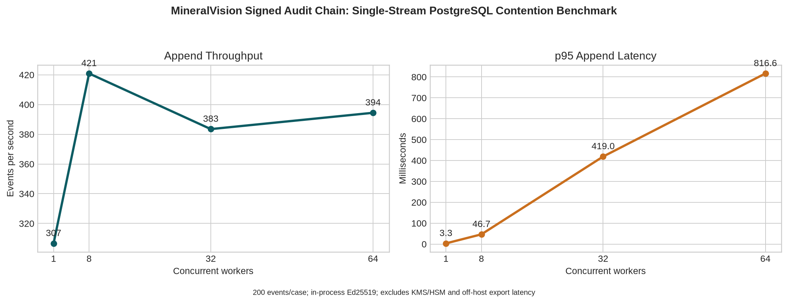

# Signed Audit Chain Concurrent Load Benchmark

**Prepared by Manus AI**  
**Date:** 22 August 2026  
**System under test:** MineralVision append-only, Ed25519-signed audit chain  
**Commit basis:** `18e6c85` plus benchmark utility

## Executive Summary

The signed audit-chain implementation was tested against a disposable local PostgreSQL database under deliberately high **single-stream** contention. Each append computes a canonical SHA-256 event commitment, signs an Ed25519 commitment in process, serializes access by locking the stream anchor row, inserts a signed event, and commits the transaction. Every benchmark case completed with zero append errors and a valid independently recomputed chain.

The measured result is not a production capacity guarantee. It excludes KMS/HSM signing latency, off-host export/collector transport, remote database latency, tenant workload mix, TLS/mTLS, backups, observability agents, and concurrent application activity. Its value is to quantify the architecture’s expected contention behavior before comparable pre-production testing.

## Test Method

The benchmark uses a PostgreSQL database created only for this measurement. It starts a new tenant/stream for each worker-count case, submits the requested event count through a `ThreadPoolExecutor`, measures per-append latency from request start through transaction commit, exports event records in memory, and verifies sequence continuity, prior-hash linkage, SHA-256 commitments, and Ed25519 signatures after every case. Synthetic rows are removed after verification.

The extended run tested 500 events per case at 1, 8, 32, and 64 concurrent workers, for 2,000 total signed audit events. The stream-anchor row lock intentionally represents the highest-contention serial-chain design.

## Measured Results

| Concurrent workers | Events | Successful appends | Throughput (events/s) | Mean latency (ms) | p50 (ms) | p95 (ms) | p99 (ms) | Max (ms) | Chain verification |
|---:|---:|---:|---:|---:|---:|---:|---:|---:|---|
| 1 | 500 | 500 | 306.592 | 3.096 | 3.016 | 3.306 | 3.553 | 22.657 | Valid; 500 events; 0 failures |
| 8 | 500 | 500 | 420.896 | 18.370 | 11.971 | 46.662 | 54.354 | 76.379 | Valid; 500 events; 0 failures |
| 32 | 500 | 500 | 383.477 | 76.685 | 11.812 | 418.995 | 498.340 | 540.721 | Valid; 500 events; 0 failures |
| 64 | 500 | 500 | 394.448 | 146.052 | 17.884 | 816.582 | 1,116.916 | 1,193.738 | Valid; 500 events; 0 failures |

The 200-event confirmatory run produced the same pattern: throughput was 310.627–362.881 events/s at 1–32 workers while p95 append latency rose from 3.118 ms to 330.854 ms. The full raw JSON results are retained as supporting evidence.

## Interpretation

Throughput peaks near eight workers in this environment and remains roughly 383–421 events/s through 64 workers. Tail latency, not throughput, is the limiting behavior: the single stream lock preserves a strict globally ordered chain but produces queueing at 32 and 64 workers. The design is appropriate for governance, security, and write-back evidence streams where strict sequence integrity is more important than sub-100-ms tail latency under bursts.

A tenant with higher sustained audit-event rates should partition independent streams by connector, workflow, project, or bounded entity domain, retaining a separate verified anchor per stream. Do not split a sequence where consumers require one globally ordered evidentiary chain. For high-rate telemetry, send raw telemetry to a separate log pipeline and append only security-significant summaries, rollups, or external evidence commitments to the signed chain.

## Pre-Production Capacity Gates

A production readiness exercise must repeat this test using the actual PostgreSQL HA topology, storage class, network path, TLS/mTLS, KMS/HSM signer, connector payload distribution, exporter, off-host collector, and expected tenant concurrency. The following gates should be agreed with product and security owners before setting an SLO.

| Gate | Required evidence |
|---|---|
| Integrity | 100% successful chain verification across every load case; zero duplicate sequence, prior-hash, commitment, or signature failures. |
| KMS/HSM | Measured append p95/p99 includes the approved signing path and key rotation behavior. |
| Export | Collector receives every sequence without gap; source and collector anchors reconcile during and after load. |
| Failure handling | Database failover, KMS failure, collector outage, retry, and recovery tests preserve order and surface visible failures. |
| Capacity | Peak expected event rate plus agreed headroom meets tenant-specific p95/p99 SLO. |
| Isolation | Multi-tenant tests prove one tenant/stream cannot degrade a separately provisioned stream beyond agreed limits. |

## Limitations

This benchmark does not compare alternative architectures, test horizontal database scaling, include audit compression/batching, or use an external HSM. A lower-latency design may batch a signed Merkle root for multiple events, but that changes evidence granularity and recovery semantics; it should be evaluated separately against audit/compliance requirements. No production deployment decision should rely solely on this local result.
