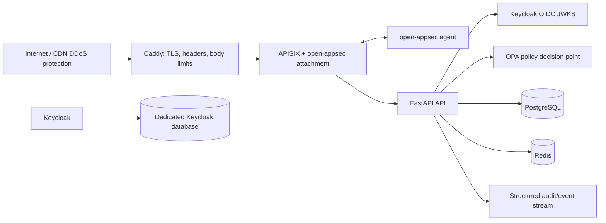

# MineralVision Security Baseline

This directory implements a **defense-in-depth baseline**, not a claim of absolute security. Production deployment must use a persistent, operator-managed environment because it requires Docker, TLS/DNS control, private networking, secrets management, external identity configuration, and continuous monitoring.

| Layer | Control | Primary threats reduced |
|---|---|---|
| Upstream | CDN/WAF and provider DDoS service, DNS protection, network firewall | Volumetric DDoS and network-layer attacks beyond application capacity. |
| Edge | Caddy TLS termination, strict headers, request-body limits; only ports 80/443 exposed | TLS downgrade, browser attacks, request smuggling surface, oversized uploads. |
| Gateway | APISIX route allow-list, Redis-backed rate limits, request-size controls, private admin plane | Application-layer DDoS, brute-force, API enumeration, costly inference abuse. |
| Application security | open-appsec APISIX attachment/agent in prevent mode after staging validation | Common and zero-day web attack patterns; this does not replace secure coding. |
| Identity | Keycloak OIDC, short-lived asymmetric tokens, MFA/step-up, no direct grant for browser users | Credential theft impact, shared secrets, excessive standing privilege. |
| Authorization | OPA deny-by-default policy-based access control (PBAC), MFA requirement for privileged oil-spill actions | Insider privilege misuse and inconsistent endpoint authorization. |
| Data | Separate PostgreSQL roles/databases, TLS, no host database port, least privilege | Lateral movement, credential blast radius, accidental data exposure. |
| Accountability | Immutable-ish application audit events, Keycloak admin/login events, gateway/WAF logs exported off-host | Insider abuse and delayed incident investigation. |
| Delivery | Least-privilege CI, pinned/policy-checked workflow, protected environment approval, no automatic production approval | Supply-chain compromise and unauthorized deployment. |

## CI Benchmark Trust Model

The public CI workflow performs only static policy/configuration checks and unit tests. It never receives sealed benchmark data, database passwords, cloud credentials, model artifacts, or a token that can approve a model. A manually triggered, environment-protected job on an organization-controlled self-hosted runner can access a mounted, read-only benchmark data release and produce an evaluation report. It may upload evidence, but it must not call the approval endpoint. A separately authorized reviewer validates the report and performs promotion through the audited API.

## Required Operator Inputs

Copy `security/.env.security.example` to a secret-managed deployment environment and supply all passwords, domain names, and Keycloak/OIDC configuration. Do not commit a populated file. The Keycloak realm export requires further realm-administrator review before import, especially WebAuthn authenticator policy and identity-provider federation.

## Deployment Choices

| Approach | Tradeoffs | Cost | Setup complexity |
|---|---|---:|---|
| **Containerized security stack (implemented here)** | Supports Caddy, APISIX/open-appsec, Keycloak, OPA, and private Docker networks. Requires a continuously operated Linux host and external DDoS/CDN service. | Infrastructure/operator dependent. | High. |
| **Managed gateway/identity alternative** | Use a managed API gateway/WAF and enterprise identity provider; fewer self-managed components, but the supplied Caddy/APISIX/open-appsec topology is not used. | Provider dependent. | Medium. |

## Non-Negotiable Operational Controls

1. Place a CDN or provider DDoS service before Caddy; APISIX rate limits cannot absorb volumetric attacks that saturate the host uplink.
2. Keep APISIX administrative ports, OPA, Redis, PostgreSQL, Keycloak administration, and metrics off the public network.
3. Enable Keycloak events and export application, gateway, WAF, host, database, and identity logs to a separate immutable or access-controlled sink.
4. Require phishing-resistant WebAuthn for privileged administrators and approvers. TOTP is acceptable only as a managed fallback according to the organization’s risk policy.
5. Protect `main`, require reviews and status checks, restrict workflow edits, use CODEOWNERS for security paths, and require an approval environment for deployments.
6. Rotate secrets, service credentials, signing keys, agent tokens, and APISIX admin keys; rehearse revocation and restoration.
7. Run staging in detection/learning mode long enough to tune WAF and policy false positives before production prevent mode.
